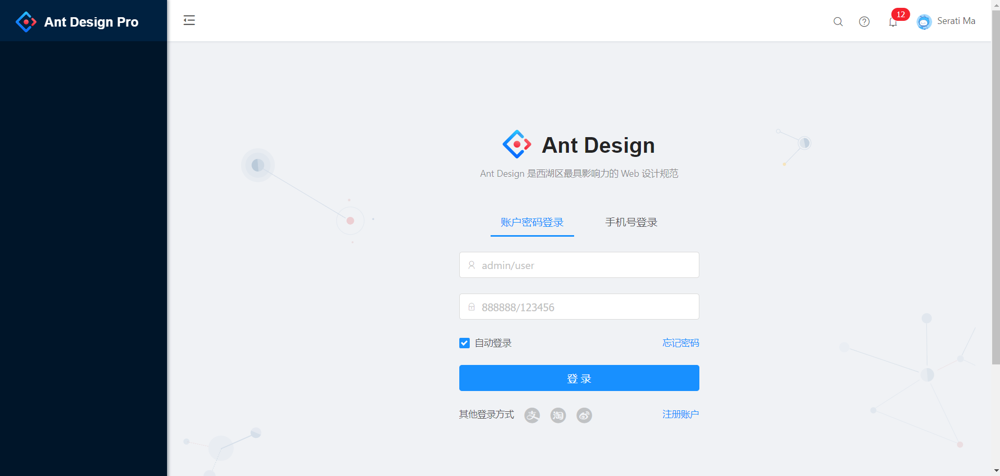

### 组件中获取路由信息？
```
const { match, routerData, localtion } = this.props;
```
总之打印一下this.props就知道了。很多东西dva在初始化路由的时候就帮我们注入了。

### 权限是怎么设计的？权限组件应该怎么学习和理解？
权限主要是根据路由来设计的。最简单的理解，如果你进入登录注册之类的/user类界面，肯定不需要判断你的权限。而其他后台界面，则都需要判断你的权限了。所以，要了解后台权限的设计，应该从路由以及权限组件<AuthorizedRoute />入手

我们知道登录界面和后台界面的布局是不一样的：登录界面呈现出全屏，而后台界面有明显的区域分割。
事实上这也是根据路由来实现的。不同的路由使用不同的布局。代码如下：
router.js
``` javascript
<Switch>
    <Route path="/user" component={UserLayout} />
    <AuthorizedRoute
        // 除了 “/user/xxxx” 以外所有的url都会匹配到 “/” 路径
        path="/"
        // 权限判定列表
        authority={['admin', 'user', 'guest', 'clouduser']}
        // 如果权限通过则渲染的组件
        render={props => <BasicLayout {...props} />}
        // 如果检查不通过重定向的地址
        redirectPath="/user/cloudlogin"
    />
</Switch>
```
<Switch>默认只会匹配一个路由。譬如我们访问/user时，按理来说既会匹配到【/user】又会匹配到【/】，理应两个路由都被渲染出来。
但由于Switch只会匹配一个，所以渲染出第一个路由之后就停止了。所以为了正确渲染出登录界面的基础布局UserLayout，必须把【/user】的route放在子前面。
如果是把【/】的组件放在前面的话，那么登录界面就会被渲染到后台界面中了。如图：


按照我们写的路由规则。除了/user（ "/user/login"，"/user/cloudlogin"，"/user/register"）的路由外，
几乎所有url都会匹配到<AuthorizedRoute/>组件。这个组件就是实现权限的核心。也是本项目最复杂的组件之一。我们将尽可能对它剖析。

<AuthorizedRoute/>组件需要传入三个属性：
- authority：权限判定列表
- render：如果权限通过则渲染的组件
- redirectPath：如果检查不通过重定向的地址

组件的使用倒是不难，而且作用一目了然。我们先对<AuthorizedRoute/>组件放一放，了解权限相关的其他文件内容。
``` javascript
/components/Authorized/
    /index.js
    /Authorized.js
    /AuthorizedRoute.js
    /CheckPermissions.js
    /renderAuthorize.js
/utils/
    /authority.js
    /Authorized.js
```

### 如何设置我当前用户的权限？
/models/login.js
``` javascript
// 设置当前登录的账号
setAuthorityCloud(response.user);
// 刷新用户权限
reloadAuthorized();
```

### 权限限制的颗粒度以及种类
颗粒度是页面级，也就是说根据用户的权限判断是否要显示该页面，如果没有权限的话那就显示404之类的页面，或者就没有导航，也或者是空白页。

权限判断分为两种：
1、是一种是判断用户有没有登陆，并且判断登陆的角色权限是否符合后台标准。
router.js

2、就是页面的精细度，譬如/fuck 只能admin才能浏览，而/shit页面所有用户都可以浏览
BasicLayout.js

### <AuthorizedRoute />权限路由组件如何传递组件
有两种渲染组件的属性可以使用
1、render（router.js）
render={props => <BasicLayout {...props} />}

2、component（BasicLayout.js）
component={item.component}

### 权限组件<AuthorizedRoute/> 相关的三个最重要文件：
主要看这三个文件，由外往内分别是： AuthorizedRoute.js -> Authorized.js -> CheckPermissions.js
1、AuthorizedRoute.js
外部使用的就是这个组件，收集属性，并且执行Authorized来验证合法性。

2、Authorized.js
拿到三个最重要的属性：
1、children：如果权限验证通过会渲染的内容。其实就是AuthorizedRoute.js中的<route />。外部可以通过两种属性方式传递组件进来，一是render，二是componet。
2、authority：没什么好说的，权限列表
3、noMatch：如果权限验证不通过会渲染的route组件。然而外部传递的是一个url。也就是<AuthorizedRoute redirectPath="/user/cloudlogin" />。

3、CheckPermissions.js
权限验证库，其实非常简单。就是获取当前用户的权限 {CURRENT}  renderAuthorize.js
然后根据authority（权限列表）中判断一下即可，如果有，就是说明权限配置成功，返回children。否则返回noMatch。
